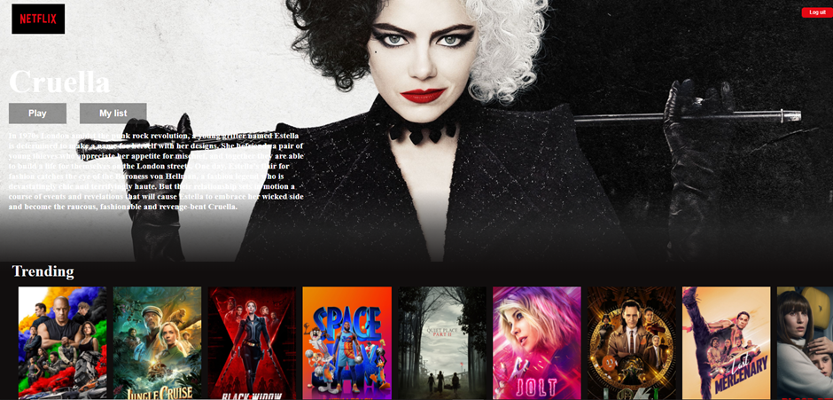
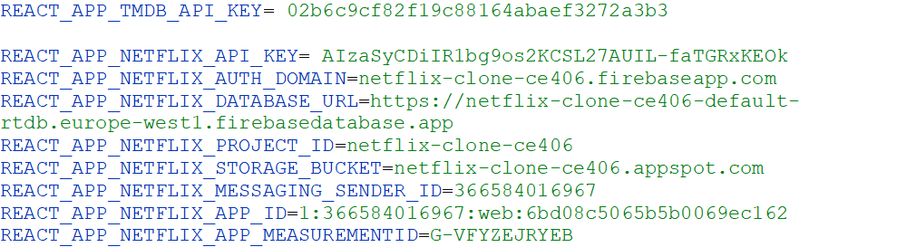

**Netflix-Clone: InstallatieHandleiding**

Dit project is een frontend clone van netflix. Het is geschreven in React plus CSS. 
Het maakt gebruik van firebase voor het opslaan en registreren van gebruikers.
Tot slot maakt het gebruik van The Movie DB API voor het weergeven van films en series plus beschrijving.

**Screenshot:**

**Lijst van dependencies om de applicatie lokaal te runnen:**\
Installeer de volgende depencies:
+     npm i firebase
      npm i axios
      npm i env install
      npm i react-router-dom
      npm install
+  Maak een .env.local file en voeg hieraan toe:

+  Run project: npm start

**Met deze gegevens kan worden ingelogd op de applicatie:**\
    Email:      example@development.com\
    Password:   password

**Functionalities:**\
De gebruiker kan eenvoudig films en tv series opzoeken vanuit TMDB.\
De gebruiker ziet "upcoming" en "trending" releases. Data wordt wekelijks bijgewerkt.\
De gebruiker kan films in de banner aanpassen. Hier wordt de titel, (release date) en\
een korte beschrijving weergegeven.\
Een bezoeker kan zich registreren op de /signup pagina.\
De gebruiker kan inloggen op de /login pagina.\
De webpagina past zich aan elke schermgrootte.

